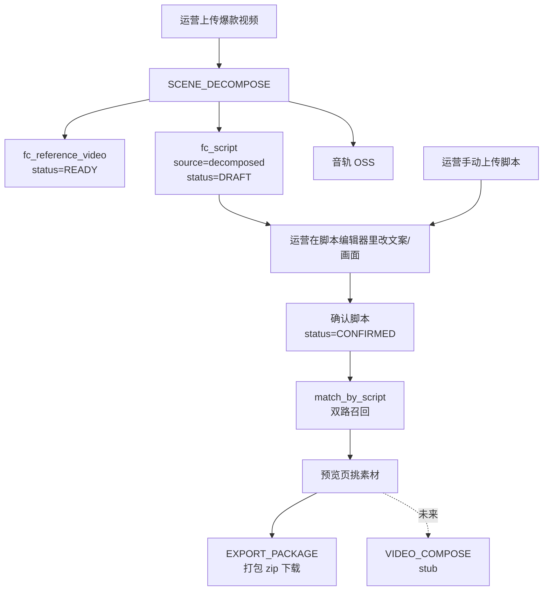

# Flowcut 架构小册

---

## 一、Flowcut 是什么

Flowcut 是抖音千川的内容生产工具. 使用流程如下: 

> 拿一条同行爆款 → 拆出它的画面和文案节奏 → 套上自家素材 → 拼成新的千川投放视频。

整套产品被切成四个 Tab——**生成 / 素材 / 成片 / 看板**。生成是核心，素材是它的原料库，成片是它的产物，看板还未实现。本文只讲生成相关的链路。

---

## 二、怎么使用simpleclaw 的

`simpleclaw/` 是从魔镜业务里抽出来的**通用 Agent 编排库**：它管对话循环、工具调用、任务队列、LLM 流式输出这些底层能力。Flowcut 把它当依赖装进来，不能往里写任何业务逻辑。

具体分工如下——

**simpleclaw 提供的、Flowcut 直接用的**：

- `ReactLoop`：对话+工具循环引擎，`POST /agent/chat` 。
- `GeminiLLM`：Gemini 的 streaming provider。Flowcut 全程只用 Gemini，定义了一个新 provider。
- `Tool` / `ToolRegistry`：工具基类和注册中心，定义 `inline` vs `durable` 两种执行模式。
- `RuntimeServices` + `TaskQueue` + `TaskWorker`：异步任务的入队、消费、scope 锁、失败重试。
- `ContextBuilder` + 系统提示稳定段缓存机制：拼系统消息、走 Volcengine/Gemini 的 prefix cache。
- `SessionStore` 的协议层：会话上下文的进出口。

**Flowcut 自己写的、不依赖 simpleclaw 的业务**：

- 整套 REST 路由（`Flowcut/api/routes/`）：UI 实际打的就是这些，不走 ReactLoop。
- `services/`：业务原子能力——Gemini 视频拆镜、PySceneDetect 物理切点对齐、bge-m3 embed( 在找火山文档做更换了 )、双向量召回、ASR 走字节 BigModel、zip 解析。
- `storage/`：MySQL 仓储 + Qdrant 向量库封装 + OSS 客户端。
- `runtime/executors.py`：所有 stream 的真正业务消费逻辑。simpleclaw 只给 worker 骨架，每条 stream 干什么由我们写的 executor 决定。
- `tools/`：12 个 Tool 类，是给 Agent 轨道留的能力封装（详见第五节）。
- `workspace/`：Agent.md / SOUL.md / TOOL.md / compliance.md，Flowcut 自己的 prompt 素材。

---

## 三、双轨：UI & 对话

后端有两条并行的入口, 后续会逐渐切为对话驱动：

- **UI 轨（当前实际跑的）**：前端按钮 → `Flowcut/api/routes/*` → 直接调 `services/` + 直接 `runtime.submit_task(stream=...)`。整个过程**不经过 Agent，也不经过 Tool**。
- **对话轨（基础设施齐全，前端未接入）**：`POST /agent/chat` → `MainAgent` → simpleclaw 的 `ReactLoop` → 调 `Flowcut/tools/` 里的 Tool → Tool 内部再调 `services/` 或入队。

为什么是双轨？因为 simpleclaw 是按"对话+工具"的形态设计的，而 Flowcut 的产品是"分阶段工作流，每步要人工确认"，UI 点按钮比对话更直接。所以新需求按一个规矩走：**业务逻辑写在 Tool 里，REST 路由只做薄薄一层 HTTP 适配**。这样 UI 轨和对话轨共用同一份业务实现，将来方便切入对话驱动的流程

---

## 四、生成 Tab 的核心流程

pipeline 示意图: 



按阶段拆开讲：

### 1）爆款拆镜

运营上传爆款，REST 路由立刻写 `fc_reference_video`、传 OSS、入队 `SCENE_DECOMPOSE`，然后返回。Worker 在后台跑两件事：

- Gemini Files API 做**语义分段**——按"这段在讲什么"切，不是按画面切。
- PySceneDetect 找物理切点，把 Gemini 给的语义时间戳**对齐到最近的物理切点**，避免切在画面中间。
- ASR 转录每段的口播文案，写进段落的 `copy` 字段。
- 把音轨抽出来单独存 OSS，方便后续单独引用。

产物是一行 `fc_script`（`source=decomposed`，`status=DRAFT`，`segments_json` 是 `[{idx, start_time, end_time, visual, copy}]`），外加一行 `fc_reference_video`（`status=READY`，`script_id` 指向上面那行脚本）。

> 一个容易踩的坑：拆镜阶段**不再产生 `fc_material`**。第一版需求的时候会把每段切成子素材入库，现在已经去掉. 

### 2）脚本编辑与确认

脚本到手后，运营在前端编辑器里可以改画面描述、改口播、合并/拆分/删除段落。脚本生命周期是这样：

```
DRAFT  ──确认──▶  CONFIRMED  ──重新编辑──▶  DRAFT
```

只有 `CONFIRMED` 状态的脚本可以触发后续召回。运营上传外部脚本也走同一张表，只是 `source=uploaded`。

### 3）素材召回（双路 max-fusion + 两阶段过滤）

确认后调 `match_by_script`，对脚本每一段并行召回。这里有两个**完全正交**的机制叠在一起，分开看：

**机制 A：双向量 max-fusion（Qdrant 层）**

素材入库时会同时算两个向量——`desc_vec`（Gemini 写的画面描述）和 `transcript_vec`（ASR 出的口播）。图片只有 desc，音频只有 transcript，视频两者都有。

查询时，脚本段会出两个查询向量——`visual` 文本 embed 出来打 `desc_vec` 池，`copy` 文本 embed 出来打 `transcript_vec` 池。对同一个素材取两路命中分的 **max**。用 max 不用平均是因为：画面和口播是两个独立信号源，谁更匹配就用谁，平均会稀释强信号。

**机制 B：当前产品+通用素材库召回（调用层）**

先按当前产品过滤召回一批，不够数再放宽到 `product IS NULL` 的通用素材兜底。产品专属和通用兜底分两栏给前端，运营自己看着挑。

### 4）素材导出

预览页确认后，调 `export_package` 入队 `EXPORT_PACKAGE`。Worker 把脚本对应的素材片段、音轨、原爆款视频一起打成 zip 传到 OSS，前端轮询 `/tasks/{id}` 拿下载链接。

### 5）合成成片（stub）

`VIDEO_COMPOSE` 流和对应的 `prepare_task()` 都还是 `NotImplementedError`。设计预期是按时间轴 FFmpeg concat + 字幕叠加 + 评估 Agent 打分循环，目前没动工。

---

## 五、素材库的入库

素材库（`fc_material` + Qdrant）目前只有两个入口，都走同一条 `MATERIAL_PROCESS` 流：

- 单文件上传：`POST /materials/upload`
- zip 批量上传：`POST /materials/upload-zip`，按 zip 里的 `{product}/{scene_role}/` 目录自动归类

Executor 里按素材类型分支：视频走 FFmpeg 抽音 → ASR → Gemini 描述 → 缩略图 → 双向量；音频走 ASR → transcript_vec；图片走 Gemini 描述 → desc_vec。任一步失败 `status=FAILED`；只有向量化挂了 → `vector_indexed=0`，等 `VECTOR_REPAIR` 每 10 分钟扫一次补建。

---

## 六、任务流速览

| Stream | 状态 | 触发 |
|---|---|---|
| `MATERIAL_PROCESS` | ✅ | `/materials/upload*` |
| `SCENE_DECOMPOSE` | ✅ | `/reference-videos/upload` |
| `VECTOR_REPAIR` | ✅ | 容器启动后 10 分钟定时 |
| `EXPORT_PACKAGE` | ✅ | `/scripts/{id}/export` |
| `VIDEO_COMPOSE` | 🚧 stub | — |
| `QIANCHUAN_PUBLISH` | 🚧 stub | — |
| `QIANCHUAN_SYNC` | 🚧 stub | — |

为什么大量动作要走队列而不是同步：Gemini 拆镜十秒到几分钟，FFmpeg 切片几十秒，素材入库 ASR+Gemini+Embedding 也是几十秒，HTTP 不能干等。队列还顺带给了 scope 锁（同一资源不会并发处理）和持久化进度（前端可以轮询）。

---

## 七、数据模型一图

```
fc_reference_video ──script_id──▶ fc_script  (1 对 1)
                                       │
                                       │ segments_json[].matched_materials[]
                                       ▼
                                  fc_material  ◀──┐
                                       ▲          │
                                       │          │
                            fc_material_usage  ──▶┘
                                       │
                                       ▼
                                  fc_creative
```

- `fc_reference_video`：爆款视频，状态只有 `PROCESSING / READY / FAILED`，product 可空。
- `fc_script`：脚本，`source ∈ {decomposed, uploaded}`，`status ∈ {DRAFT, CONFIRMED}`。
- `fc_material`：素材主表，`status` 同上家族，外加 `vector_indexed` 标 Qdrant 是否到位。
- `fc_creative`：成片表，stub 阶段表存在但没真正写入。
- `fc_material_usage`：素材↔成片多对多。
- `fc_qianchuan_account`：千川账号 OAuth，stub。

---

## 八、读代码的入口建议

如果是第一次进这个仓，按这个顺序看最省力：

1. `Flowcut/api/container.py::build_container` —— 所有依赖的组装现场，看完心里就有了对象图。
2. `Flowcut/api/routes/reference_videos.py` 和 `scripts.py` —— UI 轨实际跑的路径。
3. `Flowcut/runtime/executors.py` —— 异步任务真正干活的地方。
4. `Flowcut/services/script_generator.py`、`material_matcher.py`、`scene_align.py` —— 三块核心业务原子。
5. `Flowcut/tools/` —— 对照 services 看，理解"Tool 是 services 的薄包装，给对话轨用"。

simpleclaw 那边只在需要时跳进去看 `loop.py`、`tools/base.py`、`runtime/task_queue.py` 这三个，其他多数时候是黑盒。
