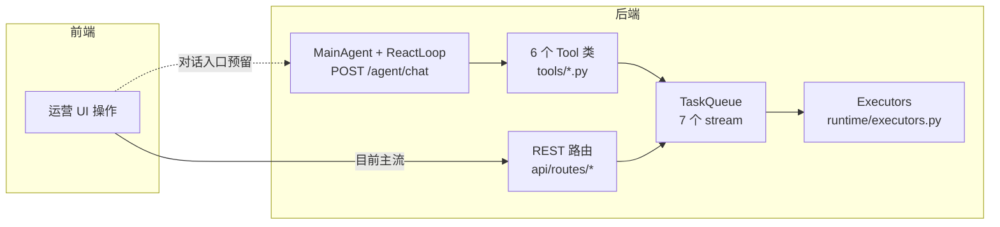
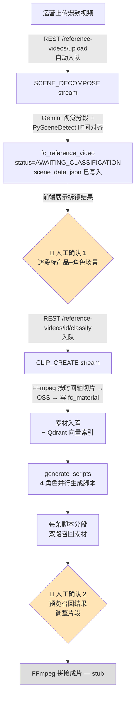
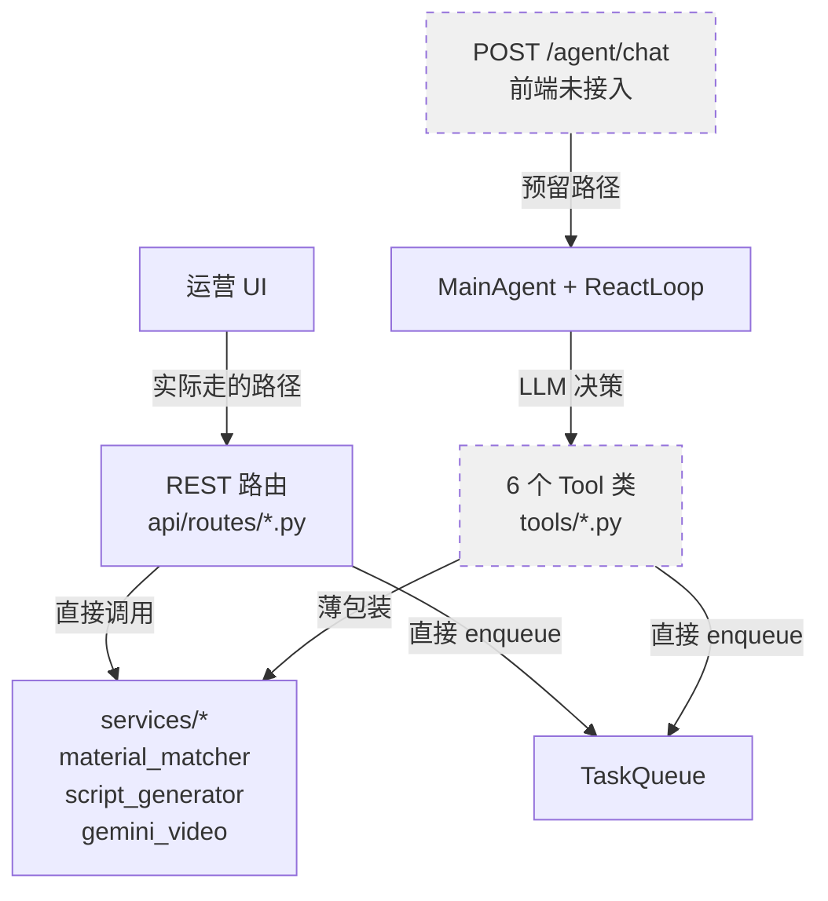
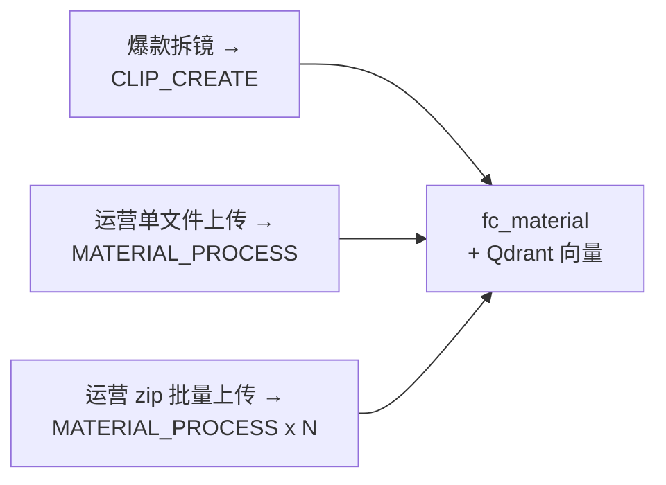
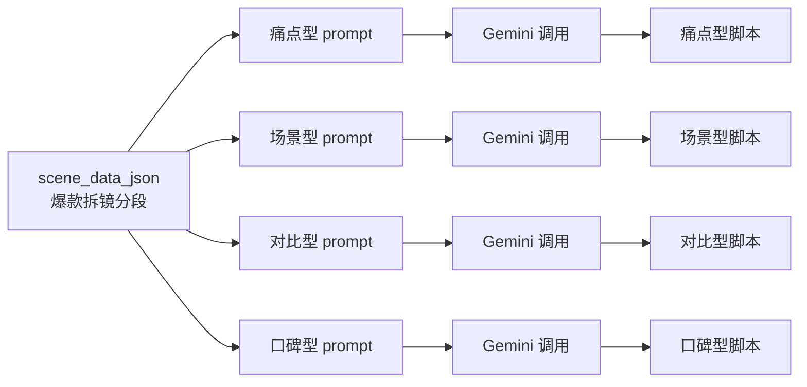
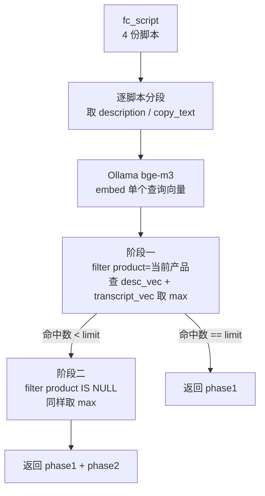

# Flowcut 流程设计文档

> 团队内部技术交付文档
> 最后更新：2026-05-20

## 0. 文档说明

- **读者**：Flowcut 后端 / 前端开发者、后续接手者
- **范围**：覆盖已实现的核心业务流程（爆款拆镜、素材入库、脚本生成、语义搜索），简要说明合成 stub 现状；**不涵盖**千川投放
- **代码定位约定**：`模块路径::函数名`，如 `Flowcut/runtime/executors.py::make_scene_decompose_executor`

---

## 1. 整体架构总览

### 1.1 前端四个 Tab：业务流程的物理划分

Flowcut 的运营动线被切成四个互相独立的 Tab，每个 Tab 是一个工作阶段，状态从左到右流转：

| Tab | 路由 | 职责 | 核心动作 |
|---|---|---|---|
| **生成** | `/` | 拆爆款 → 召回素材 → 拼成片 | 整个产品的核心，下游所有 Tab 的数据起点 |
| **素材** | `/material` | 素材库的浏览/搜索/补传 | 给"生成" Tab 提供原料；产品树导航 |
| **成片** | `/creative` | 成片复盘 + 千川投放（stub） | 看每条成片的合成结果、打标签 |
| **看板** | `/dashboard` | 数据回流（stub） | 投放数据回归分析 |

> **本文档聚焦"生成" Tab**。它是绝对核心，其他三个 Tab 只是它的上游（素材库）和下游（成片管理、数据回流）。

### 1.2 双轨架构：UI 驱动 + 对话驱动并存

Flowcut 的后端同时存在两套调用路径，理解这一点对读代码非常关键：



**双轨现状**：

- **UI 点击轨道（当前实际跑的）**：运营在前端点按钮 → 直接打 REST 路由（`Flowcut/api/routes/*`）→ REST 路由直接读写 DB、入队任务。
- **对话轨道（基础设施齐全但前端未接入）**：`POST /agent/chat` → `MainAgent` → `ReactLoop` → 调用 `Flowcut/tools/` 下 6 个 Tool 类 → Tool 内部再写 DB / 入队。

**为什么是双轨而不是单轨？**

- **现状是渐进选择的结果**：harness（`simpleclaw/`）天然按"对话 + 工具"组织（从 Mojing 继承的架构），所以基础设施全是 ReactLoop / Tool / SessionStore。但 Flowcut 的产品形态是"分阶段工作流"，每一步都需要人工确认（标分类、看脚本、挑素材），UI 更直接。
- **可选的演进路径**：保留 UI 骨架不变，把"自然语言批量操作"作为加速器接进 Agent 轨道（例如：运营在素材 Tab 用对话快速批量补描述、或者在生成 Tab 用对话表达模糊召回意图）。

### 1.3 后端核心模块（与"生成"流程相关）

| 模块 | 路径 | 职责 |
|---|---|---|
| REST 路由 | `Flowcut/api/routes/reference_videos.py`、`materials.py`、`creatives.py` | UI 直接交互入口 |
| Agent 编排 | `Flowcut/agent/main_agent.py` | 对话轨道入口（当前闲置） |
| Tools | `Flowcut/tools/decompose_video.py` 等 6 个 | Agent 可调的能力封装 |
| Task Stream | `Flowcut/runtime/streams.py` | 异步任务流定义（7 条 stream） |
| Executors | `Flowcut/runtime/executors.py` | 每条 stream 的消费逻辑 |
| Services | `Flowcut/services/gemini_video.py`、`scene_align.py`、`embedding.py`、`material_matcher.py` | 业务原子能力（Gemini、对齐、向量化、召回） |
| Storage | `Flowcut/storage/vector_store.py`、`reference_video_repo.py`、`material_repo.py` | DB 仓储 + Qdrant 向量库 |

---

## 2. "生成" Tab 核心流程

整个生成流程是一条**线性管道 + 两次人工确认**：



### 2.1 阶段一：爆款拆镜（拆出"片段时间轴 + 内容描述"）

> ⚠️ **澄清一个常见误解**：拆镜阶段**不产出脚本**。它只把爆款视频切成"语义片段"，每段附一句 Gemini 写的内容描述。脚本生成是后续独立动作（第 2.3 节）。

**触发链路**：

1. 运营在 `/`（生成 Tab）点上传 → `POST /reference-videos/upload`
   - 路由：`Flowcut/api/routes/reference_videos.py::upload_reference_video`
   - 动作：写 `fc_reference_video` 记录（status=PROCESSING）→ OSS 存视频 → **自动入队 `SCENE_DECOMPOSE`**
2. Worker 消费 `SCENE_DECOMPOSE`
   - 消费者：`Flowcut/runtime/executors.py::make_scene_decompose_executor`
   - 内部调用：
     - `services/gemini_video.py::analyze_video` —— Gemini Files API 做**语义分段**（按"这段在讲什么"切，不按画面变化切）
     - `services/scene_align.py::detect_scene_cuts` + `align_timestamps` —— PySceneDetect 找物理切点，把 Gemini 给的语义时间戳**对齐到最近的物理切点**（避免在画面中间切）
   - 产物：`fc_reference_video.scene_data_json` —— JSON 数组，每段 `{start_time, end_time, content, category, scene_role}`
   - 结束状态：`AWAITING_CLASSIFICATION`（**不直接切片**）

### 2.2 阶段二：人工分类确认（关键设计 — Human-in-the-Loop）

**为什么把"拆镜"和"切片入素材库"拆成两步，中间塞一个 `AWAITING_CLASSIFICATION` 状态？**

技术上完全可以一气呵成：拆完→自动切→入库。但**故意分两步**，原因有三：

1. **切片不可逆**：一旦切了入了 `fc_material` 和 Qdrant 向量库，污染了产品/角色场景标签的素材会反向污染后续召回。回滚要清 DB + OSS + 向量库三处，成本高。
2. **机器只看得见"内容"，看不见"业务归属"**：Gemini 能描述"一个女生在涂面霜"，但不知道这是**雪莲洗面奶**还是**XX 面霜**的素材，也不知道在产品体系里这属于"开箱角色"还是"功效演示角色"。这些标签**只有运营有**。
3. **机器分段经常需要人工调整**：Gemini 分段会过细或过粗，运营在 UI 上可以合并 / 拆分 / 删除片段，最终确认后才入库。

**实现上**：

- 前端展示 `scene_data_json` 的每段，让运营逐段填 `product` 和 `scene_role`
- 确认后调用 `POST /reference-videos/{id}/classify`（`Flowcut/api/routes/reference_videos.py`）
- 路由动作：把 `product` 和每段 `scene_role` 写回 `scene_data_json` → **入队 `CLIP_CREATE`**

### 2.3 阶段三：批量切片入素材库

- 消费者：`Flowcut/runtime/executors.py::make_clip_create_executor`
- 动作：对 `scene_data_json` 里每段：
  1. FFmpeg 按 `start_time / end_time` 切出子视频
  2. 上传 OSS（key 形如 `materials/{tenant}/{product}/clips/{ts}_{idx}.mp4`）
  3. 创建 `fc_material` 记录（带 product + scene_role + Gemini 描述）
  4. 调 `services/embedding.py::OllamaEmbeddingService` 计算双向量（desc_vec + transcript_vec），写入 Qdrant

至此爆款视频已被"分解"为素材库里若干带标签的素材，供后续脚本召回。

### 2.4 涉及的 Stream（runtime/streams.py）

本阶段用到 2 条核心 stream，外加 1 条兜底：

| Stream | 触发者 | 干什么 | 设计意图 |
|---|---|---|---|
| `SCENE_DECOMPOSE` | `POST /reference-videos/upload` 自动入队 | Gemini 分段 + PySceneDetect 对齐 → 写 `scene_data_json` | 长任务异步化，REST 立即返回，前端轮询状态 |
| `CLIP_CREATE` | `POST /reference-videos/{id}/classify` 人工确认后入队 | FFmpeg 切片 + OSS + 写素材 + 向量化 | 与拆镜分离，**强制人工确认前置** |
| `VECTOR_REPAIR` | 容器启动后定时 10 分钟扫一次 | 扫 `vector_indexed=0` 的素材补建向量 | 兜底：上一步失败的素材不会永久丢失向量 |

`MATERIAL_PROCESS`（用户直接上传素材时走的流）不在本阶段，留到第 3 节讲。

---

## 附 A. Task Stream 全景（`Flowcut/runtime/streams.py`）

7 条 stream 一览。所有 stream 的消费者在 `Flowcut/runtime/executors.py`，每条对应一个 `make_*_executor` 工厂；注册和 worker 启动在 `Flowcut/api/container.py::build_container`。

| Stream 常量 | 实现状态 | 触发方 | 消费者函数 |
|---|---|---|---|
| `MATERIAL_PROCESS` | ✅ 已实现 | REST `/materials/upload*` 系列 | `make_material_process_executor` |
| `SCENE_DECOMPOSE` | ✅ 已实现 | REST `/reference-videos/upload` | `make_scene_decompose_executor` |
| `CLIP_CREATE` | ✅ 已实现 | REST `/reference-videos/{id}/classify` | `make_clip_create_executor` |
| `VECTOR_REPAIR` | ✅ 已实现 | 容器启动后定时 10 分钟扫一次 | `make_vector_repair_executor` |
| `VIDEO_COMPOSE` | 🚧 stub | 未接 | `make_video_compose_executor` |
| `QIANCHUAN_PUBLISH` | 🚧 跳过 | — | — |
| `QIANCHUAN_SYNC` | 🚧 跳过 | — | — |

**为什么用 stream 而不是直接同步调用？**

- 拆镜要跑 Gemini（10s~数分钟），切片要跑 FFmpeg（几秒~几十秒），素材入库要跑 ASR + Gemini + Embedding（数十秒）。HTTP 请求不能在前台等这么久。
- Stream 提供**职责单一的 worker** + **scope_key 互斥锁**（同一资源不会被并发处理两次）+ **失败重试 + 持久化进度**（前端可以轮询 `RuntimeTaskRepository` 查状态）。

---

## 附 B. Tool 层与 Agent 现状（重要 — 当前架构盲点）

> 这一节解释一个**容易让新接手者困惑的事实**：`Flowcut/tools/` 下 6 个 Tool 类目前**既不被 REST 调用，也几乎不被 LLM 调用**。

### B.1 现状

代码里有两套调用入口，它们在 `services/` 层汇合：



**关键事实**：

- 全仓 `grep` 6 个 Tool 类名 → **只在 `Flowcut/api/container.py` 出现**（注册为 `tool_factories`）；任何 REST 路由都**没有 import 任何 Tool**。
- REST 路由处理业务的方式是：直接调 `services/*` + 直接 `runtime.submit_task(stream=...)`。
- 例：`POST /materials/match` 直接调 `services/material_matcher.py::match_segments_parallel`，**不经 `SearchMaterialsTool`**；`POST /reference-videos/upload` 直接 `submit_task(stream=SCENE_DECOMPOSE)`，**不经 `DecomposeVideoTool`**。
- Tool 在技术上能跑（`/agent/chat` 路由完整，`MainAgent` 已注册全部 Tool），但**前端没有任何页面连到 `/agent/chat`**。

### B.2 设计意图 vs 现状的偏差

- **初衷**：Tool 是为 Agent 设计的能力封装 —— 让 LLM 通过 ReactLoop 自主决策"现在该拆镜 / 该生成脚本 / 该搜素材"。整个 Flowcut 的对话驱动架构（继承自 Mojing harness）就是为这条路径准备的。
- **现状**：产品形态收敛成"分阶段工作流 UI"，每步都有强人工确认点（标分类、看脚本、挑素材），UI 点击比对话更直接、状态更可见。所以 Tool 层被"晾"在那里。
- **风险**：Tool 内部参数、prompt、调用顺序如果长期不被实际触发，会和 REST 路由 + services 的演进**慢慢漂移**。建议要么尽快激活（接前端对话入口），要么明确标记为"实验性 / Deprecated"避免后人误用。

### B.3 演进选项

| 选项 | 描述 | 改动 |
|---|---|---|
| **A. 维持双轨现状** | UI 继续走 REST，`/agent/chat` 闲置 | 0 改动；Tool 层逐渐成为 dead code |
| **B. 局部嵌入对话** | UI 主流程不变，在某些 Tab 嵌入对话入口作为"加速器"（如批量标分类、模糊召回） | 小：前端加对话浮窗；后端 Tool 层激活 |
| **C. 全面对话驱动**（mentor 建议方向） | 把流程做成 skill，前端只剩对话框 + 必要确认 UI | 大：前端重构；Agent prompt + Tool 需要打磨 |

> 这是个产品决策问题，不是技术决策问题。技术上选项 C 几乎零额外成本（基础设施都现成）；**真正的代价是运营心智的迁移**。

---

## 3. 素材入库流程

素材库（`fc_material` + Qdrant）有**三种入库入口**，最终都落到同一种数据形态：



### 3.1 三种入口

| 入口 | REST 路由 | Stream | 说明 |
|---|---|---|---|
| 爆款拆镜切片 | `/reference-videos/{id}/classify` | `CLIP_CREATE` | 已在第 2 节讲过 |
| 单文件上传 | `/materials/upload` | `MATERIAL_PROCESS` | 表单字段含 `product` |
| zip 批量上传 | `/materials/upload-zip` + `/upload-zip/confirm` | `MATERIAL_PROCESS × N` | 按 zip 内 `{product}/{scene_role}/` 目录结构自动归类 |

### 3.2 `MATERIAL_PROCESS` 干了什么（`Flowcut/runtime/executors.py::make_material_process_executor`）

按素材类型走不同分支：

- **视频素材**：FFmpeg 抽 16kHz WAV → 字节跳动 ASR WebSocket 转录 → Gemini 看视频写描述 → 抽缩略图 → Ollama bge-m3 计算 desc_vec + transcript_vec → 写 Qdrant
- **音频素材**：ASR 转录 → 计算 transcript_vec → 写 Qdrant
- **图片素材**：Gemini 描述 → 计算 desc_vec → 写 Qdrant（**没有 transcript_vec**）

终态：`fc_material.status = READY`、`vector_indexed = 1`。

任一步失败 → `status = FAILED`；向量化失败但其他成功 → `vector_indexed = 0`，等 `VECTOR_REPAIR` 定时补建。

### 3.3 设计思路：为什么所有入口最终走同一个 stream

三种入口在数据形态、处理动作（ASR / Gemini / Embedding）上几乎一致，**强制走同一个 worker 的好处**是：

- 后续改动（如换 embedding 模型、加新元数据字段）只需要改一处
- 失败重试、速率限制、并发控制集中在一个地方
- `VECTOR_REPAIR` 兜底逻辑天然覆盖所有入口

REST 路由的差异只在**入库前的预处理**（zip 要先解包、爆款切片要先 FFmpeg 切条），预处理完毕后**统一塞 `MATERIAL_PROCESS` 队列**。

> 例外：`CLIP_CREATE` executor 内部直接做了 Gemini 描述 + 向量化，没有再绕一圈塞回 `MATERIAL_PROCESS`。这是为了避免一次拆镜 N 段 → N 次任务队列往返的开销，是性能优化下的特例。

---

## 4. 脚本生成流程

> 🚧 **状态**：services 层和 Tool 都已实现，**前端尚未接入触发入口**。本节描述的是设计意图和已就位的代码能力。

### 4.1 设计思路：4 角色并行 + 拆镜数据复用

脚本生成的输入是**爆款拆镜的 `scene_data_json`**（同一个爆款的同一份分段），输出是**4 份风格各异的脚本**，每份脚本严格沿用爆款的分段时间轴，只重写画面指引和口播文案：



**4 个角色**（定义在 `Flowcut/services/script_generator.py::ROLES`）：

| 角色 | 风格 | 情绪基调 |
|---|---|---|
| 痛点型 | 开头直击痛点，产品作为解法登场 | 共鸣 → 希望 |
| 场景型 | 描绘真实使用场景，强代入感 | 轻松 → 向往 |
| 对比型 | 使用前后对比，制造惊喜感 | 怀疑 → 惊喜 |
| 口碑型 | 用户证言视角，增强可信度 | 信任 → 推荐 |

**为什么是 4 路并行而不是让 LLM 一次产 4 份？**

- **质量隔离**：单次 prompt 让 LLM 同时产 4 种风格容易"风味串味"，并行 + 独立 prompt 强制风格差异
- **失败局部化**：某个角色生成失败（JSON 解析失败、超时）不影响其他角色
- **延迟优化**：4 路 `asyncio.gather` 并行，端到端延迟 ≈ 单次 Gemini 调用

**为什么沿用爆款的分段时间轴而不是重新分镜？**

- 拆镜时间轴是已经过 PySceneDetect 物理对齐的，**直接复用可以保证后续合成时素材时长能对得上**
- 脚本只需要"换皮不换骨"——画面指引和口播变，节奏不变

### 4.2 代码位置

| 文件::函数 | 职责 |
|---|---|
| `Flowcut/services/script_generator.py::generate_for_role` | 单角色脚本生成（构造 prompt → 调 Gemini → 解析 JSON） |
| `Flowcut/services/script_generator.py::ROLES` | 4 个角色定义 |
| `Flowcut/tools/generate_scripts.py::GenerateScriptsTool` | Agent 工具封装（4 路 `asyncio.gather`） |

### 4.3 当前缺口

- **没有 REST 路由可调用** —— 前端无法直接触发
- **走 Agent 链路理论可行** —— `POST /agent/chat` 让 LLM 调 `GenerateScriptsTool`，但前端没接对话入口
- **产物未持久化** —— 当前 `GenerateScriptsTool` 只在 ReactLoop 上下文里返回脚本，没写 `fc_script` 表（schema 已建好等着用）

下一步如果要打通，最小改动路径：
1. 加 `POST /reference-videos/{id}/generate-scripts` 路由（直接调 `script_generator`，绕过 Agent）
2. 生成成功后写 `fc_script` 表（4 行，每行一个角色）
3. 前端在拆镜确认后新增"生成脚本"按钮，调上面的路由

---

## 5. 素材语义召回流程

### 5.1 总体：脚本驱动召回

依赖关系是**严格串行**的：脚本生成 → 每条脚本的每段去召回 → 召回结果回到前端预览。



入口：
- Agent：`Flowcut/tools/search_materials.py::SearchMaterialsTool`
- REST：`POST /materials/match`（前端实际走的路径）
- 共同实现：`Flowcut/services/material_matcher.py::match_segments_parallel`

### 5.2 双路召回的两个**正交**机制（容易混淆）

我必须把这两个机制分清楚——它们经常被合在一起说，但其实是两个独立维度：

#### 机制 A：双向量 max-fusion（在 Qdrant 层）

**素材侧（写入时是非对称的）**：

| 素材类型 | desc_vec | transcript_vec |
|---|---|---|
| 视频 | ✅ Gemini 描述 embed | ✅ ASR 转录 embed |
| 音频 | ❌（无视觉） | ✅ ASR 转录 embed |
| 图片 | ✅ Gemini 描述 embed | ❌（无音频） |

**查询侧（只有一个向量）**：

用脚本段的描述文本 embed 出**一个**查询向量，这同一个向量分别去查 `desc_vec` 池和 `transcript_vec` 池。

**融合**：对每个候选素材 id，取它在两路命中分中的 **max**（`Flowcut/storage/vector_store.py::search`）：

```python
scores[id] = max(scores.get(id, 0.0), hit.score)
```

**为什么用 max 不用 sum / 加权平均？**

- 一个素材的"画面描述"和"口播内容"是两个独立信息源，**谁更匹配查询就用谁的分**
- 加权平均会稀释强信号（一路 0.9 + 一路 0.1，平均 0.5，反不如另一个素材两路都 0.6 的 max=0.6）
- 对图片这种只有 desc_vec 的素材天然 degrade，max 不会因为缺一路而吃亏

#### 机制 B：两阶段产品过滤（在调用层）

实现在 `services/material_matcher.py::match_segment`：

```
阶段一：vector_store.search(filter: product == 当前产品, limit=3)
  ↓ if len(phase1) < limit
阶段二：vector_store.search(filter: product IS NULL, limit=need)
  ↓ 去重（phase2 中已在 phase1 出现的剔除）
最终：phase1 + phase2
```

**为什么先产品专属、再通用兜底？**

- 产品专属素材天然比通用素材匹配度高（品牌、画面、人物都对得上），先用尽专属池
- 没有专属素材时不至于"召回为空"，用通用素材兜底保证流程不卡壳
- **不是同时查两路然后混合**——是**先查 A 不够再查 B 补齐**，前端可以分别展示"产品专属推荐"和"通用素材兜底"两栏

#### 这两个机制怎么叠加

```
对脚本一段 →
  embed 出 1 个查询向量 →
  阶段一(filter product=X):
    Qdrant 在 desc_vec 池查 → 候选 A
    Qdrant 在 transcript_vec 池查 → 候选 B
    取 max(A.scores, B.scores) → phase1
  阶段二(if needed, filter product IS NULL):
    同样的双向量 max-fusion → phase2
  返回 {phase1, phase2}
```

机制 A 在每一阶段的内部都会发生，机制 B 决定阶段次数和过滤条件。两者完全正交。

### 5.3 批量并行

`match_segments_parallel` 把脚本的所有段用 `asyncio.gather` 并发跑，每段独立执行上面整套流程。N 段脚本的端到端延迟 ≈ 1 段的延迟。

---

## 6. 合成（stub 现状）

> 🚧 **状态**：完全 stub，未实现。

设计预期（来自 `Flowcut/tools/compose_video.py` 和 `runtime/executors.py::make_video_compose_executor` 的注释）：

```
输入：[脚本段, 召回素材 id] 列表（运营在前端预览页确认的最终方案）
  ↓
入队 VIDEO_COMPOSE
  ↓
Worker 执行：
  1. 按时间轴 FFmpeg concat 切片
  2. 叠加字幕（copy_text）
  3. 调评估 Agent 打分 → 不满意则换素材重试 → 满意则定稿
  ↓
写 fc_creative，OSS 存成片
```

当前 `prepare_task()` 抛 `NotImplementedError`，不会真正入队。

---

## 7. 任务编排（TaskQueue）

*（待口述补充）*

---

## 8. 数据模型

*（待口述补充）*
