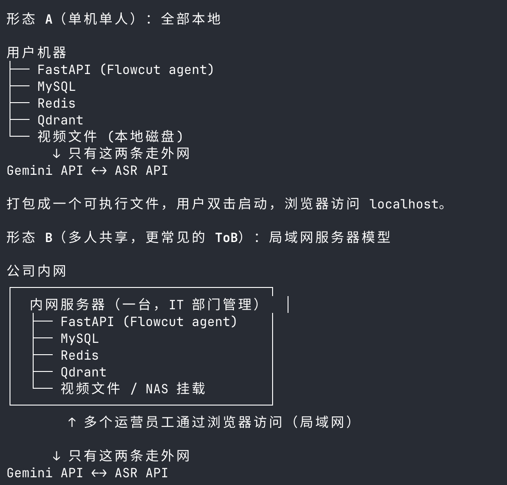

# 1. 背景
我们当前的 Flowcut 场景, 涉及到多次大流量带宽的上传和下载, 这对于我们服务的 ToB 端客户来说是致命的
因为他们有着几个 T 的素材, 本来带宽就不应该大量消耗在给我们平台的流量传输上
对于这个需求场景, 我们的服务提供形式就不应该局限于网站, 而是有对应的 app, 来分发在不同的机器上, 然后我们的服务
会统一封装一个接口, 这个接口支持从不同的地方读取视频的数据, 可以是一个局域网内的数据中心, 也可能是 B 端公司的一个云服务器

针对于大部分场景, 局域网内的数据中心和 B 端公司的云服务器, 都应该是在内网访问, 快速拿取, 不同剪辑人员都可以从那里拿到原片的, 
因此我们如果部署成网站形式, 那么就需要运营人员手动上传对应的片子到我们的服务器, 我们再进行处理, 再在服务器上进行剪辑, 再上传 OSS, 最后再让
运营人员拉取下来, 这会浪费大量的流量, 不如我们本地化部署, 直接从局域网内拉取, 流量只涉及到和 Gemini 的交互传输, 这样更合适

# 2. 需要你跟我探讨的问题
- 我这个背景清晰吗, 你能否理解, 我这个分析是否合理
- 针对于我们现有的前端 ReAct+后端 FastAPI 这样的组织架构, 我们适合使用什么样的跨平台框架, 这一部分, 我们需要详细调研, 给出一份调研报告

